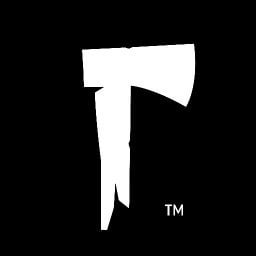

<!-- TODO : This profile looks really nice : https://github.com/ChrisTitusTech -->

### Hi I'm Tim!

I develop the
[Steam ](https://github.com/tpill90/steam-lancache-prefill),
[Battlenet ](https://github.com/tpill90/Battlenet-lancache-prefill)
and [Epic ](https://github.com/tpill90/Epic-lancache-prefill) prefills.
I also help out with the [Lancache ](https://lancache.net/) project where I can!

I sometimes write game mods too.  I've written mods for [Valheim ](https://github.com/tpill90/ValheimMods) as well as [The Long Dark ](https://github.com/tpill90/TheLongDark-Mods)

 
 

---

## &#x1f4c8; GitHub Stats

