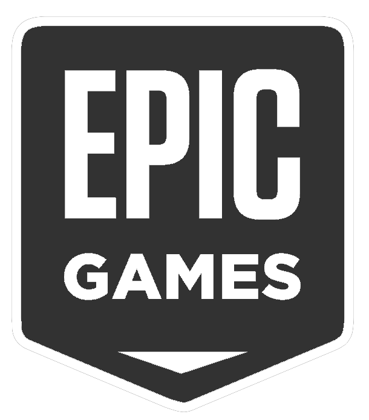

Hi I'm Tim!

I develop the 
[Steam ](https://github.com/tpill90/steam-lancache-prefill),
[Battlenet ](https://github.com/tpill90/Battlenet-lancache-prefill)
and [Epic ](https://github.com/tpill90/Epic-lancache-prefill) prefills.

I also help out with the [Lancache ](https://lancache.net/) project where I can!

---

## &#x1f4c8; GitHub Stats

 

